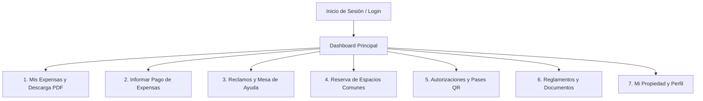

# 📘 Manual e Instructivo del Propietario
## Club de Campo La Ranita — Portal Web de Autogestión

---

### 🌐 Acceso al Portal
* **Enlace Web Oficial:** [https://access.elevensistemas.com/login](https://access.elevensistemas.com/login)
* **Compatibilidad:** 100% responsive, compatible con computadoras de escritorio (PC/Mac), tablets y teléfonos móviles (iOS y Android).

---

### 👤 Datos del Usuario de Prueba Simulado

Para realizar pruebas, demostraciones o capacitaciones, se ha configurado el siguiente perfil de residente activo con liquidación real:

| Campo | Valor de Prueba |
| :--- | :--- |
| **Propietario / Residente** | **Ana Santora** |
| **Lote / Unidad** | **Lote 14** (Manzana A) |
| **Correo Electrónico (Login)** | `s.ana@laranita.com` |
| **Contraseña Provisoria** | `password` |
| **Saldo Liquidación Septiembre 2026** | **\$785.107,14** (1° Vto: 10/10/2026) / **\$853.651,14** (2° Vto: 20/10/2026) |

---

### 🏦 Datos Bancarios Oficiales del Consorcio

Para cancelar expensas mediante transferencia o depósito bancario, los pagos deben dirigirse **exclusivamente** a la cuenta oficial de **Banco Supervielle**:

| Detalle | Información Oficial |
| :--- | :--- |
| **Entidad Bancaria** | **Banco Supervielle** |
| **Titular de la Cuenta** | **CLUB DE CAMPO LA RANITA S.A** |
| **CUIT** | **30-70085295-0** |
| **Tipo y N° de Cuenta** | **Cuenta Corriente en Pesos: 017-19096/001** |
| **CBU** | **0270017510000190960011** |
| **Alias CBU** | `CLUB.RANITA.SUPER` *(o el provisto por Administración)* |

> ⚠️ **Importante:** Cada vez que realice un pago por transferencia, debe ingresar a la plataforma y reportarlo en la sección **"Informar Pago"** adjuntando el comprobante para su rápida conciliación.

---



---

## 1. Inicio de Sesión y Acceso al Sistema

1. Ingrese a la dirección web: [https://access.elevensistemas.com/login](https://access.elevensistemas.com/login).
2. Introduzca su **Correo Electrónico** registrado y su **Contraseña**.
3. Haga clic en el botón verde **"Iniciar Sesión"**.
4. *(Opcional)* Si olvidó su contraseña, haga clic en *"¿Olvidaste tu contraseña?"* para recibir un correo seguro de restablecimiento.

```
┌────────────────────────────────────────────────────────────────────────┐
│                        CLUB DE CAMPO LA RANITA                         │
│                           Portal Propietarios                          │
├────────────────────────────────────────────────────────────────────────┤
│                                                                        │
│   Correo Electrónico:  [ s.ana@laranita.com                          ] │
│   Contraseña:          [ ••••••••••••                                ] │
│                                                                        │
│   [  INICIAR SESIÓN  ]          [ ¿Olvidaste tu contraseña? ]          │
│                                                                        │
└────────────────────────────────────────────────────────────────────────┘
```

---

## 2. Pantalla Principal (Dashboard)

Al acceder, el residente encuentra una vista compacta estilo iOS con toda la información clave de su lote:

1. **Tarjeta de Saldo Destacada:** 
   - Muestra el saldo pendiente de liquidación.
   - Detalla el beneficio de **Pronto Pago (1° Vencimiento)** con fecha límite y el valor al **2° Vencimiento**.
   - Acceso inmediato al botón **"Informar Pago"** y **"Mis Expensas"**.
2. **Accesos Directos Rápidos:**
   - 🧾 **Mis Expensas:** Consulta de recibos mensuales.
   - 💳 **Informar Pago:** Carga de comprobantes de transferencia.
   - 💬 **Reclamos:** Solicitud de mantenimiento o consultas operativas.
   - 📅 **Reservas:** Solicitud de turnos para el SUM, parrillas y canchas.
   - 🎟️ **Invitados:** Pases QR para agilizar el ingreso en garita.
   - 📁 **Documentos:** Reglamentos de construcción y convivencia.
3. **Módulo de Novedades Institucionales:** Últimas comunicaciones oficiales emitidas por la administración.

```
┌────────────────────────────────────────────────────────────────────────┐
│  MI RANITA              Lote 14 - Ana Santora             🔔 [Perfil]  │
├────────────────────────────────────────────────────────────────────────┤
│                                                                        │
│  ┌──────────────────────────────────────────────────────────────────┐  │
│  │  ESTADO DE CUENTA - SEPTIEMBRE 2026                              │  │
│  │  Saldo a Pagar: $ 785.107,14 (Pronto Pago hasta el 10/10/2026)   │  │
│  │  Importe 2° Vto: $ 853.651,14 (Vencimiento: 20/10/2026)          │  │
│  │                                                                  │  │
│  │  [ 💳 INFORMAR PAGO ]             [ 🧾 VER MIS EXPENSAS ]        │  │
│  └──────────────────────────────────────────────────────────────────┘  │
│                                                                        │
│  [ 🧾 Expensas ]   [ 💳 Pagos ]   [ 💬 Reclamos ]   [ 📅 Reservas ]    │
│  [ 🎟️ Invitados ]  [ 📁 Documentos ]  [ 🚗 Vehículos ]  [ ⚙️ Ajustes ] │
│                                                                        │
└────────────────────────────────────────────────────────────────────────┘
```

---

## 3. Mis Expensas y Descarga de Liquidación PDF

**Ruta en el menú:** `Expensas` → `Mis Expensas` (`/owner/expenses`)

Permite visualizar el historial mes a mes de todas las liquidaciones generadas para el lote:

* **Período Liquidado:** Mes y año (ej. *Septiembre 2026*).
* **1° Vencimiento (Pronto Pago):** Importe bonificado abonando hasta el día 10.
* **2° Vencimiento:** Importe regular abonando hasta el día 20.
* **Estado:** `Pendiente`, `Pagada` o `Vencida`.
* **Botón "Descargar PDF":** Genera y descarga el comprobante oficial membretado con el detalle discriminado de gastos ordinarios, extraordinarios y fondo de reserva.

---

## 4. Informar Pago de Expensas (Banco Supervielle)

**Ruta en el menú:** `Pagos` → `Informar Pago` (`/owner/payments/report`)

Cada vez que realice una transferencia bancaria, complete este sencillo formulario:

1. **Importe Transferido ($):** Escriba el monto exacto de la transferencia realizada.
2. **Fecha de Pago:** Indique el día en que se realizó la operación bancaria.
3. **Medio de Pago:** Seleccione *Transferencia Bancaria* o *Depósito Bancario*.
4. **Banco Destino:** Preseleccionado automáticamente en **Banco Supervielle** (Cuenta oficial del Country).
5. **N° de Comprobante / Referencia:** Ingrese el número de transacción o ID del comprobante del home banking.
6. **Adjuntar Comprobante:** Suba la foto o archivo PDF del comprobante bancario (JPG, PNG o PDF).
7. **Observaciones:** Notas aclaratorias si aplica (ej. *"Pago correspondiente a expensa Septiembre lote 14"*).
8. Presione **"Confirmar y Enviar Aviso de Pago"**.

```
┌────────────────────────────────────────────────────────────────────────┐
│  INFORMAR TRANSFERENCIA BANCARIA                                       │
├────────────────────────────────────────────────────────────────────────┤
│                                                                        │
│  Banco Destino:       [ Banco Supervielle (Cta Cte 017-19096/001)   ▼] │
│  Importe Abonado ($): [ 785107.14                                    ] │
│  Fecha de Operación:  [ 05/10/2026                                   ] │
│  N° Transacción/Ref:  [ 9843210984                                   ] │
│  Adjuntar Archivo:    [ 📎 Comprobante_Supervielle_Lote14.pdf        ] │
│  Observaciones:       [ Pago expensa septiembre pronto pago          ] │
│                                                                        │
│  [  ENVIAR INFORME DE PAGO  ]                                          │
│                                                                        │
└────────────────────────────────────────────────────────────────────────┘
```

> 💡 **Trazabilidad:** El pago ingresará en estado `Pendiente de Verificación`. En cuanto el departamento contable verifique la acreditación en el extracto del Banco Supervielle, el pago pasará automáticamente a estado `Conciliado` y su saldo quedará en \$0,00.

---

## 5. Mesa de Ayuda y Reclamos

**Ruta en el menú:** `Reclamos` (`/owner/tickets`)

Permite canalizar dudas, sugerencias o solicitudes de mantenimiento con número de seguimiento y trazabilidad formal:

### Crear un Nuevo Reclamo:
1. Haga clic en **"Nuevo Reclamo"** (`/owner/tickets/create`).
2. **Categoría:** Seleccione el rubro correspondiente (*Mantenimiento General*, *Alumbrado Público*, *Seguridad*, *Espacios Verdes*, *Administración / Contable*).
3. **Prioridad:** Normal, Media o Urgente.
4. **Asunto:** Título breve del problema (ej. *"Luz tenue en luminaria poste 24 frente al lote 14"*).
5. **Descripción:** Detalle de la situación.
6. **Foto / Adjunto:** Adjunte una fotografía del problema.
7. Presione **"Enviar Reclamo"**.

### Seguimiento e Historial:
* En la lista de reclamos podrá verificar el estado en tiempo real: `Abierto`, `En Progreso`, `Resuelto` o `Cerrado`.
* Al hacer clic en un reclamo, podrá ver los comentarios y respuestas del personal de administración y responder en el mismo hilo de conversación.

---

## 6. Reserva de Espacios Comunes e Instalaciones

**Ruta en el menú:** `Reservas` (`/owner/reservations`)

Gestione el uso de las instalaciones comunitarias del barrio de forma equitativa y transparente:

1. **Catálogo de Espacios:**
   - **SUM / Salón Principal:** Para eventos familiares o sociales.
   - **Quincho y Parrillas:** Espacios de asador.
   - **Canchas de Tenis / Pádel:** Turnos deportivos.
   - **Cancha de Fútbol.**
2. **Cómo Reservar:**
   - Seleccione el espacio deseado.
   - Elija la **Fecha** y el **Rango Horario**.
   - Indique la cantidad aproximada de asistentes.
   - Acepte el reglamento de uso y cuidado de instalaciones.
   - Haga clic en **"Solicitar Reserva"**.
3. **Estado de la Solicitud:** La reserva quedará confirmada o en revisión según las políticas de cada espacio.
4. **Cancelación:** Puede cancelar sus reservas programadas directamente desde su panel si no hará uso del turno.

---

## 7. Autorización de Visitas y Pases QR para Garita

**Ruta en el menú:** `Invitados` (`/owner/guests`)

Agilice el ingreso de sus familiares, amigos, delivery y proveedores de servicios a través del control de seguridad:

1. **Tipos de Autorización:**
   - **Visita Puntual / Individual:** Para una persona en un día específico (Nombre, Apellido, DNI, Patente del auto).
   - **Visita Frecuente:** Para familiares directos o personal recurrente.
   - **Lista de Evento:** Para cumpleaños o reuniones sociales, cargando la nómina de invitados.
2. **Generación del Pase Digital QR:**
   - El sistema genera un código QR exclusivo para la visita.
   - Puede enviar el pase digital directamente por WhatsApp al invitado.
   - Al llegar a la garita, el personal de seguridad escanea el código o verifica el DNI para permitir un acceso ágil y seguro.
3. **Revocación:** Puede dar de baja cualquier autorización activa con un solo clic.

---

## 8. Documentos, Reglamentos y Actas

**Ruta en el menú:** `Documentos` (`/owner/documents`)

Repositorio digital con toda la documentación oficial del consorcio clasificada por categorías:

* **Reglamentos:** Reglamento Interno de Convivencia, Reglamento de Construcción y Obras Particulares, Normativa de Mascotas y Velocidad.
* **Actas de Asamblea:** Resoluciones y memorias de las asambleas ordinarias y extraordinarias.
* **Balances y Rendiciones:** Informes contables y estados financieros del barrio.
* **Formularios:** Solicitudes de obra, autorizaciones de mudanza y planos de referencia.

---

## 9. Mi Propiedad y Mi Perfil

### Mi Propiedad (`/owner/property`)
* Verifique la nómina de **vehículos registrados** con sus respectivas patentes.
* Consulte el padrón de **residentes y convivientes** declarados para su unidad funcional.

### Mi Perfil (`/owner/profile`)
* **Datos de Contacto:** Actualice su número de teléfono celular y correo electrónico para no perderse ninguna notificación.
* **Notificaciones:** Elija si desea recibir avisos de expensas y novedades por Email o WhatsApp.
* **Seguridad:** Cambie su contraseña de acceso cuando lo desee.
* **Modo Oscuro:** Active el modo oscuro para una visualización más descansada en horarios nocturnos.

---

## 10. Preguntas Frecuentes (FAQ)

### ¿Hasta qué día rige el Pronto Pago de las expensas?
El beneficio de Pronto Pago (1° Vencimiento) rige hasta el **día 10 de cada mes**. A partir del día 11 y hasta el día 20 aplica el importe del 2° Vencimiento.

### ¿Puedo pagar por transferencia desde cualquier banco?
Sí, puede transferir desde cualquier cuenta bancaria o billetera virtual (Mercado Pago, bancos tradicionales, etc.), siempre enviando los fondos a la cuenta oficial de **Banco Supervielle** de *CLUB DE CAMPO LA RANITA S.A*.

### ¿Cuánto demora en impactar mi pago?
Una vez que sube el comprobante en **"Informar Pago"**, la administración realiza la conciliación bancaria en un plazo habitual de 24 a 48 horas hábiles.

### ¿Cómo contacto a la administración si tengo una urgencia?
Puede abrir un ticket de reclamo clasificado como **Urgente** desde la sección **Mesa de Ayuda**, o comunicarse a las líneas telefónicas de guardia publicadas en el portal.

---
*Club de Campo La Ranita — Sistema de Gestión y Portal de Autogestión*
