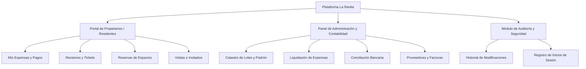
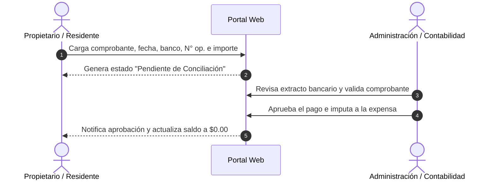
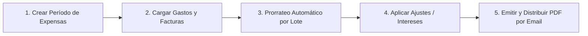

# Manual Integral de Usuario y Administración
## Sistema de Gestión Barrio Cerrado La Ranita Country Club

---

## 📑 Tabla de Contenidos
1. [Introducción y Arquitectura del Sistema](#1-introducción-y-arquitectura-del-sistema)
2. [Acceso, Autenticación y Seguridad](#2-acceso-autenticación-y-seguridad)
3. [Guía para el Propietario / Residente (Mi Portal)](#3-guía-para-el-propietario--residente-mi-portal)
   - [3.1 Inicio y Resumen de Cuenta](#31-inicio-y-resumen-de-cuenta)
   - [3.2 Consulta y Descarga de Expensas](#32-consulta-y-descarga-de-expensas)
   - [3.3 Cuenta Corriente y Movimientos](#33-cuenta-corriente-y-movimientos)
   - [3.4 Cómo Informar un Pago](#34-cómo-informar-un-pago)
   - [3.5 Gestión de Reclamos y Soporte](#35-gestión-de-reclamos-y-soporte)
   - [3.6 Reservas de Espacios Comunes](#36-reservas-de-espacios-comunes)
   - [3.7 Autorización de Visitas e Invitados](#37-autorización-de-visitas-e-invitados)
   - [3.8 Documentos y Novedades](#38-documentos-y-novedades)
4. [Guía para Administradores, Contadores y Operadores](#4-guía-para-administradores-contadores-y-operadores)
   - [4.1 Dashboard y Métricas Ejecutivas](#41-dashboard-y-métricas-ejecutivas)
   - [4.2 Gestión de Lotes y Unidades Funcionales](#42-gestión-de-lotes-y-unidades-funcionales)
   - [4.3 Padrón de Propietarios y Residentes](#43-padrón-de-propietarios-y-residentes)
   - [4.4 Liquidación y Emisión de Expensas](#44-liquidación-y-emisión-de-expensas)
   - [4.5 Conciliación de Pagos e Imputación](#45-conciliación-de-pagos-e-imputación)
   - [4.6 Proveedores y Cuentas a Pagar](#46-proveedores-y-cuentas-a-pagar)
   - [4.7 Mesa de Ayuda y Gestión de Reclamos](#47-mesa-de-ayuda-y-gestión-de-reclamos)
   - [4.8 Administración de Espacios Comunes y Reservas](#48-administración-de-espacios-comunes-y-reservas)
   - [4.9 Comunicaciones y Novedades Institucionales](#49-comunicaciones-y-novedades-institucionales)
   - [4.10 Importador Masivo de Datos](#410-importador-masivo-de-datos)
5. [Módulo de Auditoría y Control de Accesos](#5-módulo-de-auditoría-y-control-de-accesos)
   - [5.1 Bitácora de Modificaciones y Cargas (Audit Logs)](#51-bitácora-de-modificaciones-y-cargas-audit-logs)
   - [5.2 Registro de Inicios de Sesión (Login Logs)](#52-registro-de-inicios-de-sesión-login-logs)
6. [Configuración del Sistema y Parámetros Globales](#6-configuración-del-sistema-y-parámetros-globales)

---

## 1. Introducción y Arquitectura del Sistema

El sistema de **La Ranita Country Club** es una plataforma web integral diseñada para centralizar y optimizar la administración comunitaria, la gestión contable de expensas, el control de accesos y la comunicación directa entre los vecinos y la administración.

### Roles y Perfiles del Sistema
- **Administrador General**: Acceso total a finanzas, configuración, gestión de usuarios, auditoría y catastro.
- **Operador / Guardia / Mantenimiento**: Gestión operativa de reclamos, reservas, autorización de accesos y comunicaciones.
- **Contable / Auditor**: Enfoque en liquidación de expensas, conciliación bancaria, proveedores y balances.
- **Propietario / Residente**: Gestión de su lote, descarga de expensas, informe de pagos, reclamos y reservas de amenidades.
- **Inquilino / Co-residente**: Acceso a gestiones autorizadas por el propietario de la unidad.

---

## 2. Acceso, Autenticación y Seguridad

### 2.1 Inicio de Sesión
1. Ingrese a la dirección web del sistema: `https://laranita.tucooperativa.com/login` (o en entorno local `http://localhost/LA%20RANITA%20ADMIN/public/login`).
2. Introduzca su **Correo Electrónico** registrado y su **Contraseña**.
3. Haga clic en **Ingresar**.

> [!IMPORTANT]
> El sistema redirige automáticamente al usuario según su rol:
> - Los administradores y contadores ingresan a `/admin/dashboard`.
> - Los propietarios y residentes ingresan a `/owner/dashboard`.

### 2.2 Medidas de Seguridad Automáticas
- **Protección contra fuerza bruta**: Tras 5 intentos fallidos consecutivos de contraseña, el sistema bloquea temporalmente el acceso por seguridad y registra el evento en la bitácora de seguridad.
- **Auditoría de Acceso**: Cada intento (exitoso, fallido o bloqueado) queda registrado con dirección IP, fecha, hora, navegador y dispositivo.

---

## 3. Guía para el Propietario / Residente (Mi Portal)

### 3.1 Inicio y Resumen de Cuenta
Al acceder al portal, el vecino visualiza:
- **Estado de Cuenta Actual**: Saldo a favor o deuda pendiente consolidada.
- **Próximo Vencimiento**: Fecha límite y monto de la última expensa emitida.
- **Botones de Acción Rápida**: "Informar Pago", "Nuevo Reclamo", "Reservar Cancha/SUM".
- **Últimas Novedades y Avisos Importantes**: Comunicados recientes emitidos por la administración.

---

### 3.2 Consulta y Descarga de Expensas
**Ruta:** `Menú lateral > Mis Expensas`

1. Se listan todos los períodos de expensas emitidos ordenados cronológicamente.
2. Cada registro indica:
   - **Período** (Ej. Octubre 2026).
   - **Monto 1º Vencimiento** y **2º Vencimiento**.
   - **Estado** (`Pagada`, `Pendiente`, `Vencida`).
3. Para ver el detalle o imprimir la liquidación, haga clic en el botón **Descargar PDF** o **Ver Detalle**.

---

### 3.3 Cuenta Corriente y Movimientos
**Ruta:** `Menú lateral > Mi Cuenta Corriente`

Muestra el libro de movimientos de su lote:
- **Débitos (+)**: Cargas de expensas ordinarias, extraordinarias, recargos por mora o reservas con costo.
- **Créditos (-)**: Pagos realizados e imputados a su favor.
- **Saldo Evolutivo**: Balance actualizado en tiempo real.

---

### 3.4 Cómo Informar un Pago
Cuando realiza una transferencia bancaria o depósito, debe informarlo a través del sistema para su rápida acreditación:

#### Pasos para la Carga:
1. Diríjase a `Informar Pago`.
2. Complete los campos requeridos:
   - **Fecha del Pago**: Día en que realizó la transferencia.
   - **Monto Transferido**: Importe exacto en pesos argentinos.
   - **Banco / Medio**: Banco de origen o plataforma (Mercado Pago, Galicia, etc.).
   - **Número de Operación / Transferencia**: Código de transacción que figura en el comprobante.
   - **Adjunto**: Suba la foto o PDF del comprobante bancario.
3. Haga clic en **Enviar Informe de Pago**. El estado figurará como `Pendiente` hasta que administración lo valide.

---

### 3.5 Gestión de Reclamos y Soporte
**Ruta:** `Menú lateral > Mis Reclamos`

1. Haga clic en **Nuevo Reclamo**.
2. Seleccione el **Tipo / Categoría** (Ej. *Mantenimiento de Calles, Luminarias, Seguridad, Espacios Verdes, Convivencia*).
3. Ingrese un **Título descriptivo** y el **Detalle de la situación**.
4. (Opcional) Adjunte fotografías del inconveniente.
5. Podrá ver las respuestas del equipo de administración y recibir notificaciones cuando el estado cambie a *En Progreso* o *Resuelto*.

---

### 3.6 Reservas de Espacios Comunes
**Ruta:** `Menú lateral > Espacios Comunes / Reservas`

1. Seleccione la amenidad deseada (*Cancha de Tenis, Cancha de Pádel, SUM Principal, Quincho*).
2. Consulte el calendario interactivo con los turnos disponibles en verde.
3. Seleccione el **Día** y la **Franja Horaria**.
4. Lea y acepte el reglamento de uso de las instalaciones.
5. Haga clic en **Confirmar Reserva**. Si la amenidad tiene arancel, se sumará automáticamente a su próxima liquidación de expensas.

---

### 3.7 Autorización de Visitas e Invitados
**Ruta:** `Menú lateral > Autorización de Visitas`

- Permite precargar los datos de familiares, amigos o personal de obra/servicio que ingresará a su lote.
- Ingrese Nombre, Apellido, DNI y Fecha/Rango de validez.
- La guardia de seguridad podrá validar el ingreso inmediatamente en garita sin necesidad de llamadas telefónicas demorosas.

---

## 4. Guía para Administradores, Contadores y Operadores

### 4.1 Dashboard y Métricas Ejecutivas
El panel de control centraliza los indicadores clave del country club:
- **Tasa de Recaudación del Mes**: Porcentaje de expensas cobradas vs pendientes.
- **Deuda Total Acumulada**: Monto global en mora.
- **Lotes Activos y Propietarios Registrados**.
- **Tickets y Reclamos Abiertos** que requieren atención urgente.

---

### 4.2 Gestión de Lotes y Unidades Funcionales
**Ruta:** `Menú lateral > Lotes`

- **Alta y Edición de Lotes**: Código de lote (Ej. `L-104`), número, superficie en $m^2$, coeficiente de prorrateo de expensas.
- **Vinculación Dominial**: Asignar propietario titular, inquilino o cotitulares.
- **Historial del Lote**: Ver la trazabilidad de propietarios anteriores, obras registradas y bitácora de novedades.

---

### 4.3 Padrón de Propietarios y Residentes
**Ruta:** `Menú lateral > Propietarios`

- Registro de DNI/CUIT, razón social, teléfonos de contacto, correos electrónicos principales y secundarios.
- Envío de invitaciones de acceso al portal y restablecimiento de credenciales.
- Estado de cuenta unificado por propietario (incluso si posee múltiples lotes).

---

### 4.4 Liquidación y Emisión de Expensas
**Ruta:** `Menú lateral > Expensas > Períodos y Liquidación`

1. **Crear Período**: Seleccione Mes y Año (Ej. Octubre 2026), 1º Fecha de Vencimiento y 2º Vencimiento.
2. **Carga de Gastos del Mes**: Ingrese los ítems de gastos ordinarios y extraordinarios vinculados a facturas de proveedores.
3. **Cálculo de Liquidación**: El sistema calcula la cuota proporcional de cada lote según su coeficiente.
4. **Emisión y Notificación**: Con un solo clic, se generan las liquidaciones individuales, se actualizan las cuentas corrientes y se envían las expensas por correo electrónico a todos los propietarios.

---

### 4.5 Conciliación de Pagos e Imputación
**Ruta:** `Menú lateral > Pagos > Conciliación`

1. Visualice el listado de **Pagos Informados por Propietarios**.
2. Coteje el comprobante adjunto y el número de operación con el extracto de la cuenta bancaria del Country.
3. **Aprobar Pago**:
   - El sistema imputa el dinero a la expensa más antigua con deuda (o genera saldo a favor).
   - Se emite el recibo oficial digital.
   - Se notifica automáticamente al residente.
4. **Rechazar Pago**: Permite especificar el motivo (Ej. *Comprobante ilegible, Importe no acreditado*) para que el vecino vuelva a informarlo.

---

### 4.6 Proveedores y Cuentas a Pagar
**Ruta:** `Menú lateral > Proveedores`

- Catálogo de proveedores clasificados por rubro (*Seguridad, Mantenimiento de Piscinas, Electricidad, Jardinería*).
- Registro de facturas recibidas, montos, fechas de vencimiento y estado de pago.

---

### 4.7 Mesa de Ayuda y Gestión de Reclamos
**Ruta:** `Menú lateral > Reclamos`

- Tablero Kanban o lista interactiva de reclamos.
- Asignación a operarios o cuadrillas de mantenimiento.
- Carga de notas internas privadas (visibles solo para administradores) y respuestas públicas para el residente.
- Cierre y calificación de satisfacción del servicio.

---

## 5. Módulo de Auditoría y Control de Accesos

Este módulo garantiza la total transparencia y seguridad operativa del sistema.

### 5.1 Bitácora de Modificaciones y Cargas (Audit Logs)
**Ruta:** `Menú lateral > Auditoría > Pestaña: Auditoría de Cambios y Cargas`

- **Registro Automático**: Cada vez que un administrador, contador u operador crea, modifica o elimina un registro (un lote, un pago, una expensa, un usuario, un proveedor, etc.), el sistema guarda:
  - **Operador Responsable** (Nombre y correo).
  - **Módulo y Registro Afectado** (Ej. *Propietario #45*).
  - **Tipo de Acción** (`Creación`, `Modificación`, `Eliminación`).
  - **Dirección IP** del equipo de trabajo.
- **Inspector de Cambios (Diff Modal)**: Al hacer clic en el botón **"Ver Cambios"**, se despliega una comparativa en tabla donde se resalta en **rojo** el valor anterior y en **verde** el nuevo valor modificado.

### 5.2 Registro de Inicios de Sesión (Login Logs)
**Ruta:** `Menú lateral > Auditoría > Pestaña: Registro de Inicios de Sesión (Logins)`

- Supervisa todos los accesos a la plataforma:
  - Logins Exitosos.
  - Intentos Fallidos de contraseña.
  - Accesos Bloqueados por exceso de intentos.
  - Dispositivo, Navegador (Edge, Chrome, Safari) y Sistema Operativo (Windows, iOS, Android).

---

## 6. Configuración del Sistema y Parámetros Globales

**Ruta:** `Menú lateral > Configuración`

- **Datos Institucionales**: Nombre oficial, CUIT, teléfono de guardia, dirección postal y logotipo.
- **Servidor de Correo (SMTP)**: Configuración para el despacho de expensas y avisos por email.
- **Parámetros Financieros**: Tasa de interés mensual por mora, recargo de 2º vencimiento y datos bancarios oficiales para transferencias.
